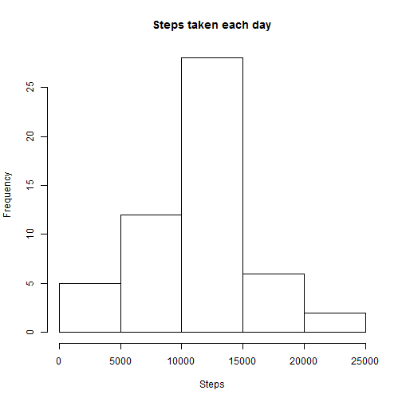
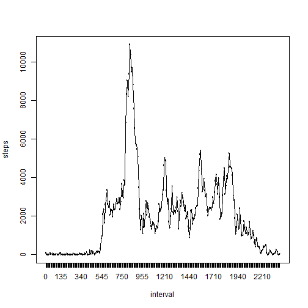
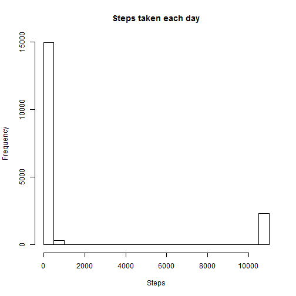
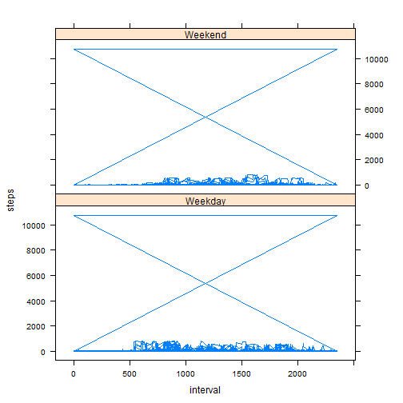

# Reproducible Research: Peer Assessment 1


## Loading and preprocessing the data

```r
activity <- read.csv("~/R/RepData_PeerAssessment1/activity.csv")
activity$date <- as.Date(activity$date)
activity$steps <- as.numeric(activity$steps)
activity <- na.omit(activity)

a2 <- rowsum(activity$steps, activity$date, na.rm = TRUE)
a2 <- as.table(a2)
a2 <- as.data.frame(a2)
a2[2] <- a2[3]

names(a2) <- c("date", "steps")
```


## What is mean total number of steps taken per day?

```r
hist(a2$steps, xlab = "Steps", main = "Steps taken each day")
```

 

```r
mean(a2$steps)
```

```
## [1] 10766
```

```r
median(a2$steps)
```

```
## [1] 10765
```


## What is the average daily activity pattern?

```r
a3 <- rowsum(activity$steps, activity$interval, na.rm = TRUE)
a3 <- as.table(a3)
a3 <- as.data.frame(a3)
a3[2] <- a3[3]

names(a3) <- c("interval", "steps")

plot(a3$interval, a3$steps, type = "l", xlab = "interval", ylab = "steps")
lines(a3$interval, a3$steps, type = "l")
```

 

```r
a3[a3$steps == max(a3$steps), ]
```

```
##     interval steps    NA
## 104      835 10927 10927
```


## Imputing missing values

```r
a4 <- read.csv("~/R/RepData_PeerAssessment1/activity.csv")
a4$date <- as.Date(a4$date)
a4$steps <- as.numeric(a4$steps)

sum(is.na(a4$steps))
```

```
## [1] 2304
```

```r
a4[is.na(a4)] <- mean(a2$steps)

hist(a4$steps, xlab = "Steps", main = "Steps taken each day")
```

 

```r
mean(a4$steps)
```

```
## [1] 1444
```

```r
median(a4$steps)
```

```
## [1] 0
```


## Are there differences in activity patterns between weekdays and weekends?

```r
d <- weekdays(a4$date) == "Sunday" | weekdays(a4$date) == "Saturday"
d[d == FALSE] <- "Weekday"
d[d == TRUE] <- "Weekend"
a4$day <- d

library(lattice)
```

```
## Warning: package 'lattice' was built under R version 3.0.3
```

```r
xyplot(steps ~ interval | day, data = a4, layout = c(1, 2), type = "l")
```

 

